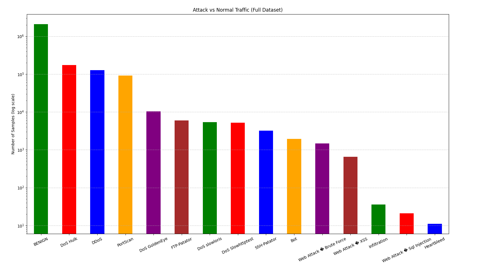
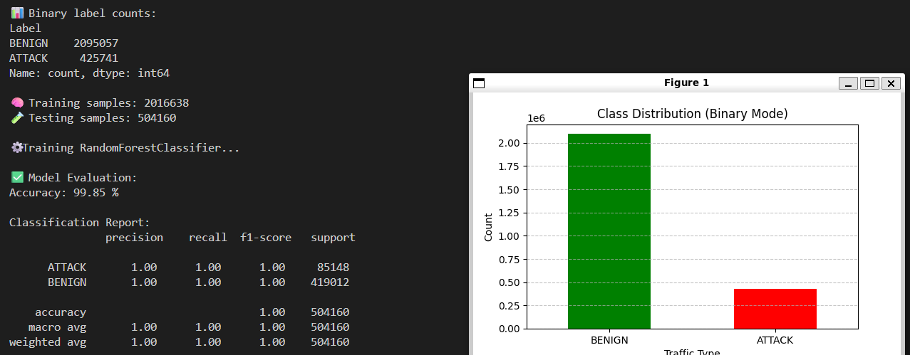

# Traffic Analyzer (CIC-IDS2017)

A Python-based network traffic analyzer for intrusion detection using machine learning. This project uses the **CIC-IDS2017** dataset to detect normal vs attack traffic (binary classification) and later extended to multi-class classification for specific attack types.

---

## 📂 Project Structure

```
Traffic-Analyzer/
├── BinaryClassification.py      # Script for binary classification (Normal vs Attack)
├── check.py                     # Script to inspect dataset and view statistics
├── combined_cicids2017.csv      # Merged dataset from all CSV files
├── combine.py                   # Script to combine all CSVs into one dataset
├── MachineLearningCVE/          # Folder containing original CSV dataset files
├── network_traffic_data.csv     # Optional additional dataset
├── requirements.txt             # requirements.txt file containing all the requirements
├── README.md                    # This file
└── ...

```
---

## Requirements

- Python 3.8+
- Libraries:

```bash
pip install -r requirements.txt
```

> if you get any error use virtual env

---

## Usage

### Combine all dataset CSVs

i have already done it but 

```bash
python combine.py
```

This merges all CSV files in `MachineLearningCVE/` into `combined_cicids2017.csv`.


### Inspect the dataset

```bash
python check.py
```

This prints the first 5 rows, number of rows/columns, and class distribution.




# Train Model

## Binary Classification

Run the script:

```bash
python BinaryClassification.py
```

Trains a **RandomForestClassifier** to classify **BENIGN vs ATTACK** traffic and saves the model, label encoder, and scaler for later use.



here you can see we got an `99.85 %` Accuracy

---

## multi-class classification

> To do

---


## 📊 Dataset

**CIC-IDS2017** dataset includes:

* **Normal traffic:** BENIGN
* **Attacks:** DoS Hulk, DDoS, PortScan, FTP-Patator, SSH-Patator, Web Attacks, Botnet, Heartbleed, Infiltration, etc.
* **Features:** 79 network flow features extracted using CICFlowMeter
* **Format:** CSV

---


## 📚 References

* Sharafaldin, I., Lashkari, A. H., & Ghorbani, A. A. (2018). *Toward Generating a New Intrusion Detection Dataset and Intrusion Traffic Characterization.* ICISSP.
* [CIC-IDS2017 Dataset](https://www.unb.ca/cic/datasets/ids-2017.html)

---

## 📝 License

This project is for **educational and research purposes only**. Use responsibly.

---
